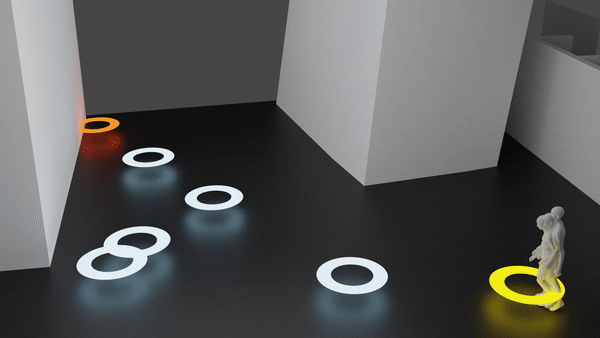

# GAMMA: The Wanderings of Odysseus in 3D Scenes

<p align="center">
  
</p>

This repo contains the official implementation of our paper. If you find our work useful in your research, please consider citing it:

```
@inproceedings{zhang2022wanderings,
  title={The Wanderings of Odysseus in 3D Scenes},
  author={Zhang, Yan and Tang, Siyu},
  booktitle={Proceedings of the IEEE/CVF Conference on Computer Vision and Pattern Recognition},
  pages={20481--20491},
  year={2022}
}
```

[[website](https://yz-cnsdqz.github.io/eigenmotion/GAMMA/)] [[paper](https://arxiv.org/abs/2112.09251)] [[talk](https://www.youtube.com/watch?v=HpcQBEwF4wk&t=2s)]


# License
* Third-party software employs their respective license. Here are some examples:
    * Code/model/data relevant to the SMPL-X body model follows its own license.
    * Code/model/data relevant to the AMASS dataset follows its own license.
    * Blender and its SMPL-X add-on employ their respective license.

* The rests employ the **Apache 2.0 license**. When using the code, please cite our work as above.


# Installation

### Environment
* **Tested OS:** Ubuntu 20.04, Windows 10, Windows 11
* **Packages:** Primary software packages are listed below. See `requirements.txt` for details.
    * Python >= 3.8
    * [PyTorch](https://pytorch.org) >= 1.8
    * [Open3D](http://www.open3d.org) == 0.13.0
    * torchgeometry == 0.1.2
    * [smplx](https://smpl-x.is.tue.mpg.de)
    * [vposer](https://github.com/nghorbani/human_body_prior): checkpoint version 1.0

### Datasets
* [**AMASS**](https://amass.is.tue.mpg.de): We downloaded and used the `SMPL+H G` bodies. To get better performance (e.g. bodies without self-interpenetration), please use `SMPL-X G` bodies instead. Note that the data formats of `SMPL-X G` might be different.
* [**Cubes**](https://drive.google.com/drive/folders/1apT4ap84vaMwomSYymbVEBIIG-yQO5Yw?usp=sharing): Our synthetic scene with cubes as blockers. 
    * It includes the scene mesh, the navigation mesh, walking paths. 
    * The blender file conrtains the python script to visualize motions.
    * See [this use case](https://yz-cnsdqz.github.io/eigenmotion/GAMMA/) for more details. 
    * When they are downloaded, put them into `exp_GAMMAPrimitive/data/Cubes/*`

### Paths
* To run the code properly it is important to set the paths of data, body model, and others. See `exp_GAMMAPrimitive/utils/config_env.py` for more details.

### AMASS Canonicalization
* required for training and visualizing motion primitives.
* `exp_GAMMAPrimitive/utils/utils_canonicalize_amass.py` extracts short sub-sequences from AMASS and performs canonicalization.
* run `python exp_GAMMAPrimitive/utils/utils_canonicalize_amass.py [num_motion_primitives]`. 
* `num_motion_primitives` is the number of primitives in each sub-sequence. We set to 1 and 10, respectively. So we prepare **two** processed datasets.

### Models
* [**CMU 41** marker placement](https://drive.google.com/file/d/1CcNBZCXA7_Naa0SGlYKCxk_ecnzftbSj/view?usp=sharing)
* [**SSM2 67** marker placement](https://drive.google.com/file/d/1ozQuVjXoDLiZ3YGV-7RpauJlunPfcx_d/view?usp=sharing)
* [**Pre-trained Checkpoints**](https://drive.google.com/drive/folders/1jODy-rssGq8WN1qCSOrOxvTw2wYNskPD?usp=sharing): put these folders into `results/exp_GAMMAPrimitive/`.

### Visualizating Motion in Blender
* Blender 2.93 or above.
* Install the [SMPL-X add-on](https://www.youtube.com/watch?v=DY2k29Jef94)

# Motion Generation

### Generating and Visualizing Long-term Motions
* Select a pre-trained model policy, e.g. `MPVAEPolicy_v0`.
* Run the following scripts, and save the results to e.g. `results/tmp123/GAMMAVAEComboPolicy_PPO/MPVAEPolicy_v0`:
```
## a faster version with less control in tree search
python exp_GAMMAPrimitive/gen_motion_long_in_Cubes_parallel.py --cfg MPVAEPolicy_v0

## or, a slower version with more control in the tree search
python exp_GAMMAPrimitive/gen_motion_long_in_Cubes.py --cfg MPVAEPolicy_v0
```
* **Visualization in Blender**
    * Open Blender, and open `exp_GAMMAPrimitive/data/Cubes/synthetic_scene_000.blend`.
    * (optional) import the navigation mesh `scene_cubes_000_navimesh.obj`.
    * Change the path in the python script, and click RUN.


### Generating and Visualizing Motion Primitives
* To generate motion primitives, it needs canonicalized AMASS sequences as motion seeds.
* Run e.g.
```
python exp_GAMMAPrimitive/gen_GAMMAprimitive.py --cfg MPVAECombo_1frame_female_v10
```
* Set the path in `exp_GAMMAPrimitive/vis_GAMMAprimitive.py`, and run
```
python exp_GAMMAPrimitive/vis_GAMMAprimitive.py
```
* The results will save into the same folder.


# Train
Given a model configuration `cfg`, the checkpoints will be automatically saved into `results/exp_GAMMAPrimitive/cfg/*`.

### Train Body Regressors
* Two kinds of body regressors for female and male, respectively. Here we only show one example.
* Set the model configurations like in `exp_GAMMAPrimitive/cfg/MoshRegressor_v3_female.yml`.
* To train the model, run 
```
python exp_GAMMAPrimitive/train_GammaRegressor.py --cfg MoshRegressor_v3_female
```
* Since the SMPL-X model is used for the inverse kinematics loss, training the body regressor is much slower than training the marker predictors.


### Train Marker Predictors
* first train marker predictors from scratch with individual motion primitives, and then fine-tune it with longer sub-sequences.
* Set the model configurations like in `exp_GAMMAPrimitive/cfg/MPVAE_*frame_*.yml`.
* To train the model scratch, run
```
python exp_GAMMAPrimitive/train_GammaPredictor.py --cfg MPVAE_*frame_v2
```
* To fine-tune the model with rollout, run 
```
python exp_GAMMAPrimitive/train_GammaPredictor.py --cfg MPVAE_*frame_v4 --resume_training 1
```
* If the checkpoint is not found, copy the pre-trained checkpoint and rename it to `epoch-000.ckp`.


### Train their Combo (optional)
* We did not observe benefits to train them jointly. But we still leave the code for users to explore. 
Depending on the motion seed and the gender, there should be 4 combos, here we just show one of them as example.
* Set the model configurations like in `exp_GAMMAPrimitive/cfg/MPVAECombo_1frame_female_v10.yml`.
* Run `python exp_GAMMAPrimitive/train_GammaCombo.py --cfg MPVAECombo_1frame_female_v10`.

### Train Motion Policy
* The motion policy is trained in a separate setting. 
* Set the model configurations like in `exp_GAMMAPrimitive/cfg/MPVAEPolicy_v0.yml`.
* To train the policy, run
```
python exp_GAMMAPrimitive/train_GammaPolicy.py --cfg MPVAEPolicy_v0
```

# Acknowledgement
We appreciate [Gramazio Kohler Research](https://gramaziokohler.arch.ethz.ch) to provide architecture CAD models for experiments. Visualizations of body motions are largely based on the SMPL-X blender add-on.
We appreciate [Jonathan Lehner](https://github.com/JonathanLehner) to develop visualizations in Nvidia Omniverse.


